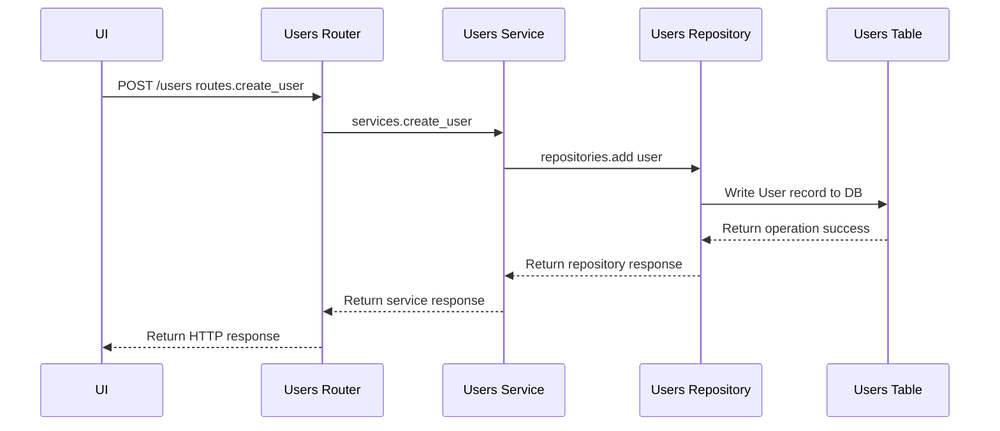

# Chalkboard Demo Users Microservice

This repository contains the code for the chalkboard_demo_users project, which consists of two interconnected microservices: Users Service and Todos Service. The Users Service is responsible for managing user-related operations.

## Table of Contents

- [Technologies Used](#technologies-used)
- [Project Considerations](#project-considerations)
  - [Embrace Async Operations](#embrace-async-operations)
  - [Embrace Repository Pattern](#embrace-repository-pattern)
- [Directory Structure](#directory-structure)
  - [Users Service](#users-service)
- [API Endpoints](#api-endpoints)
- [Setup Instructions](#setup-instructions)
  -[Run Local](#run-local)
  -[Run via Docker](#run-via-docker)
- [cURL Request Examples](#curl-request-examples)
- [Running Tests](#running-tests)

## Technologies Used

The following technologies were used in this project:

- FastAPI
- PostgreSQL
- SQLAlchemy
- Docker
- OpenAPI/Swagger

## Project Considerations

### Async Operations
- **Improved Performance:** Non-blocking operations allow handling more concurrent requests efficiently.
- **Scalability:** Utilizes server resources better by overlapping tasks and improving CPU and I/O utilization.
- **Responsive Applications:** Ensures applications remain responsive to requests, providing faster responses to clients.

### Repository Pattern

1. **Repository Pattern Overview**
   - Abstracts data access logic, separating it from the application's business logic.
   - Provides centralized access to data, hiding details of data storage, retrieval, and manipulation.

2. **Key Components**
   - **Data Access Abstraction:** Encapsulates logic for CRUD operations, shields the business logic from database specifics.
   - **Separation of Concerns:** Promotes modular and maintainable code by isolating changes in data storage technology or schema.

3. **Implementation Alignment**
   - **Router (Controller) Layer:** Handles HTTP requests, validates inputs, delegates processing to the service layer.
   - **Service (Business Logic) Layer:** Implements application-specific rules, coordinates with repositories for data operations.
   - **Repository (Data Access) Layer:** Manages database interactions, offers a unified interface for data access operations.

  - Repository Pattern: Create User Example


4. **Advantages**
   - **Testability:** Enables independent testing of business logic using mock repositories.
   - **Flexibility:** Minimizes impact of database technology or schema changes by confining them to the repository layer.
   - **Centralized Data Access:** Promotes code reuse, ensures consistent data access patterns across the application.

## Directory Structure

The directory structure of this project is as follows:

### Users Service

- `repositories/user_repository.py`: This file implements database operations using SQLAlchemy.
- `routers/user_routes.py`: This file defines API routes and endpoints using FastAPI. It depends on services for handling requests.
- `services/users_service.py`: This file implements the business logic and coordinates with repositories.
- `create_db.py`: This script is used for database creation.
- `database.py`: This file contains the setup for the database connection.
- `main.py`: This file initializes the FastAPI app.
- `models.py`: This file defines the SQLAlchemy model for User.
- `schemas.py`: This file defines the Pydantic schemas for input/output validation.

## API Endpoints

- Create a User: POST /users/
- Read Users: GET /users/
- Read a User by ID: GET /users/{user_id}/
- Update a User: PUT /users/{user_id}/
- Delete a User: DELETE /users/{user_id}/

## Setup Instructions

### Run Local

To set up and run this project locally, follow these instructions:

1. Clone the repository and navigate to the root directory of the project:
    ```sh
    git clone https://github.com/brianroytman/chalkboard-demo-users.git
    cd chalkboard-demo-users
    ```

2. Install the required dependencies:
    ```sh
    pip install -r requirements.txt
    ```

3. Set up the database:
    - Run the following command to create the database:
    ```sh
    py create_db.py
    ```

4. Start the Users Service:
    - Run the following command to start the User Service:
    ```sh
    uvicorn main:app --reload --port 8001
    ```

5. Access the User Service API documentation:
    - Open your web browser and go to `http://localhost:8001` to access the Swagger UI documentation and endpoints for the User Service API.


6. Interact with Users service endpoints via web browser or Postman
    - Sample cURL requests provided below
    [cURL Request Examples](#curl-request-examples)

### Run via Docker

To set up and run this project with Docker, follow these instructions:

1. Clone the repository and navigate to the root directory of the project:
```sh
git clone https://github.com/brianroytman/chalkboard-demo-users.git
cd chalkboard-demo-users
```

2. Make sure Docker is installed on your machine:

3. Run Docker Compose:
```sh
docker-compose build
docker-compose up
```

4. Access the Users service in your web browser:
```sh
http://localhost:8001
```

5. Interact with Users service endpoints via web browser

## cURL Request Examples
- GET /users/
```sh
curl -X 'GET' \
  'http://127.0.0.1:8001/users' \
  -H 'accept: application/json'
```

- POST /users/
```sh
curl -X 'POST' \
  'http://127.0.0.1:8001/users' \
  -H 'accept: application/json' \
  -H 'Content-Type: application/json' \
  -d '{
  "email": "testing@gmail.com",
  "first_name": "Test",
  "last_name": "Me",
  "username": "TestMeAgain"
}'
```

-GET /users/{user_id}
```sh
curl -X 'GET' \
  'http://127.0.0.1:8001/users/1' \
  -H 'accept: application/json'
```

- PUT /users/{user_id}/
```sh
curl -X 'PUT' \
  'http://127.0.0.1:8001/users/1' \
  -H 'accept: application/json' \
  -H 'Content-Type: application/json' \
  -d '{
  "email": "johnnydoe@gmail.com",
  "first_name": "Johnny",
  "last_name": "Doe",
  "username": "jd"
}'
```

- DELETE /users/{user_id}/
```sh
curl -X 'DELETE' \
  'http://127.0.0.1:8001/users/6' \
  -H 'accept: */*'
```

## Running Tests

To run the tests for this project, use the following commands:

```sh
py -m unittest -v routers/test_routes.py
py -m unittest -v services/test_services.py
py -m unittest -v repositories/test_repository.py
```
